<p align="center">
  
</p>

<h1 align="center">ClipKeeper</h1>

<p align="center">
  <b>A tray companion for OBS: keeps your recording from breaking and keeps your clips.</b><br>
  Recording guard · clip library · trim editor · statistics
</p>

<p align="center">
  <b>English</b> · <a href="README.ru.md">Русский</a>
  &nbsp;|&nbsp;
  <a href="https://github.com/Alukkart/ClipKeeper/releases/latest"><b>⬇ Download</b></a>
  &nbsp;|&nbsp;
  Windows 10 / 11 · OBS 28+
</p>

<p align="center">
  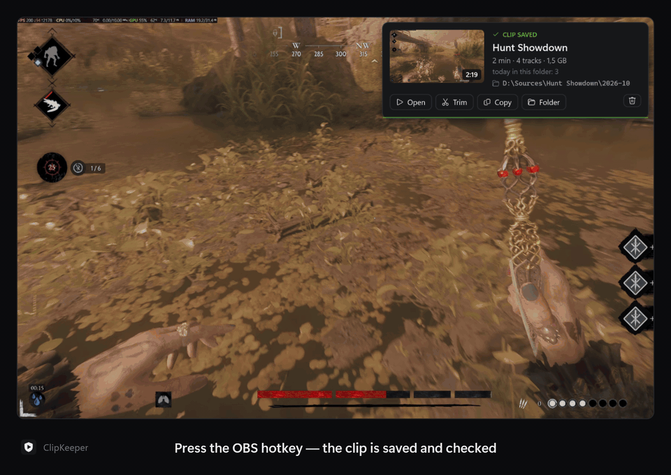
</p>

---

## Why

You record with the OBS replay buffer and press a hotkey when something good happens. ClipKeeper makes sure that
the clip is actually there — with the right devices, all audio tracks and no frozen picture — and then helps you
find it, trim it and share it.

- **It watches the recording** from the outside, through obs-websocket, and fixes what breaks by itself:
  lost devices after a driver or audio software update, a crashed replay buffer, a silent source, a black screen.
- **It keeps your clips**: a library by game with covers, a frame-exact trim editor with cuts and per-track volume,
  and statistics of what you record and what you keep.

Both halves work on their own — turn off the one you don't need in **Settings → General**.

## Screenshots

| Library by game | A game's clips |
|:---:|:---:|
| 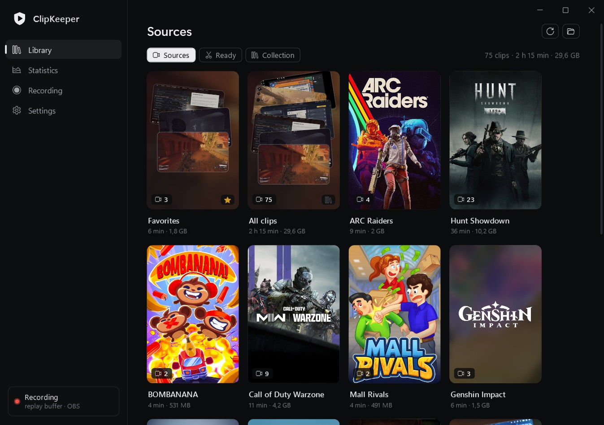 | 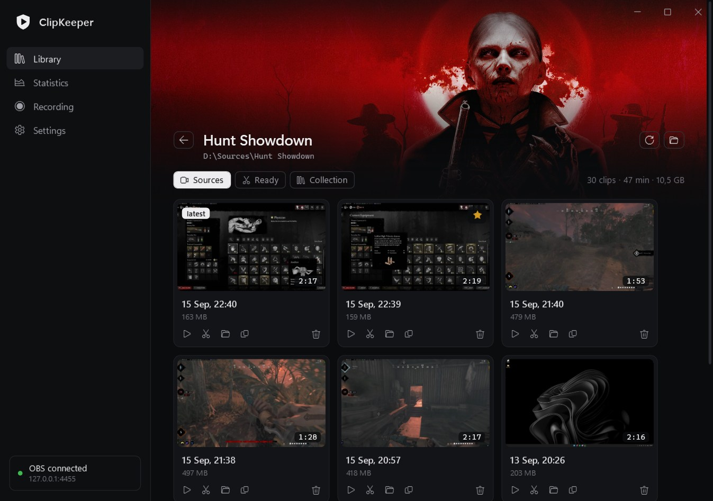 |
| **Trim editor** — cuts, per-track lanes | **Recording guard** — status, tiles, sources |
| 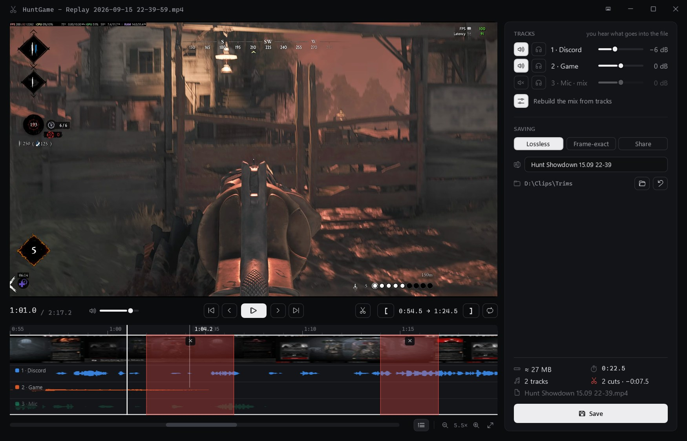 | 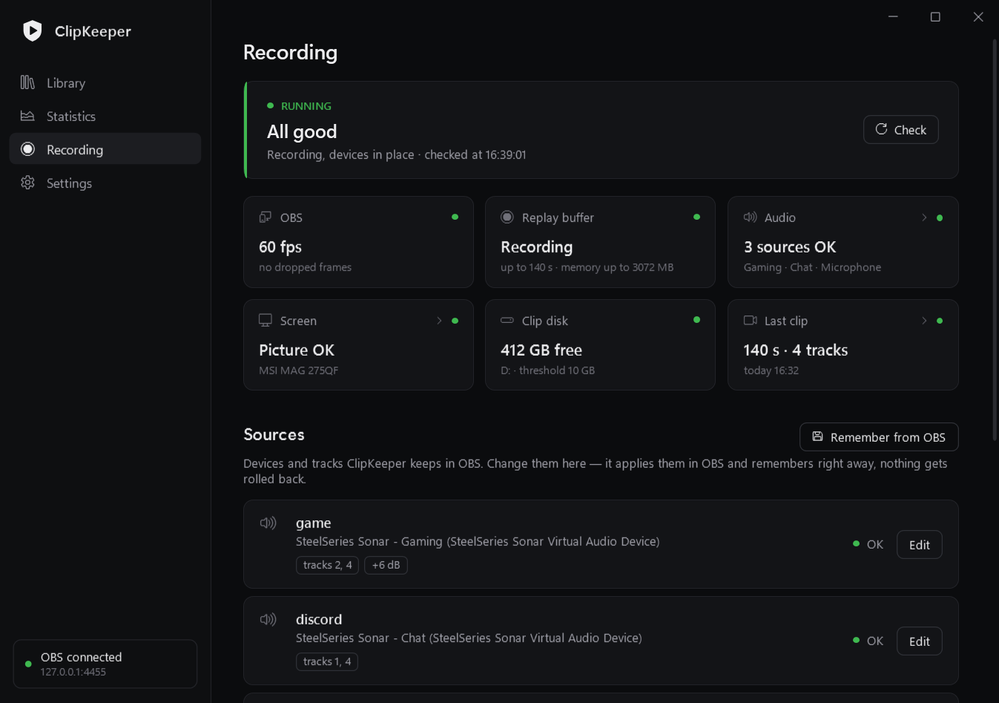 |
| **Statistics** | **First-run setup** |
| 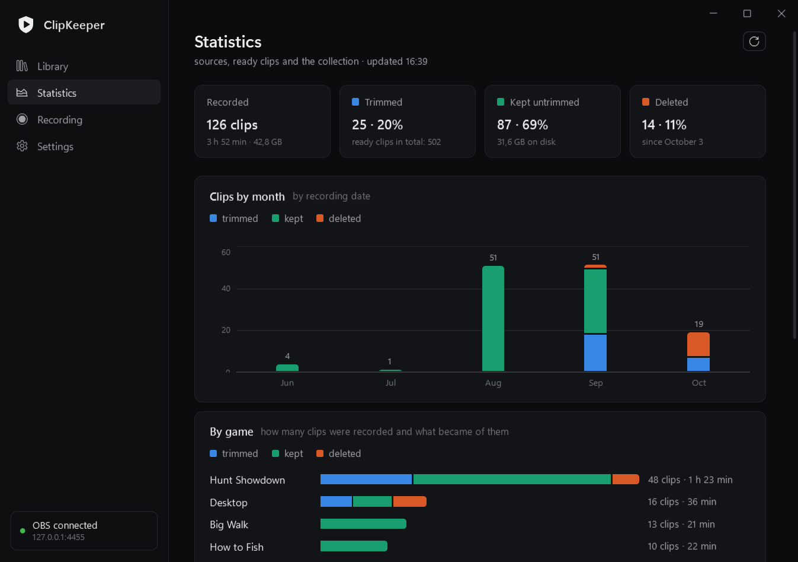 | 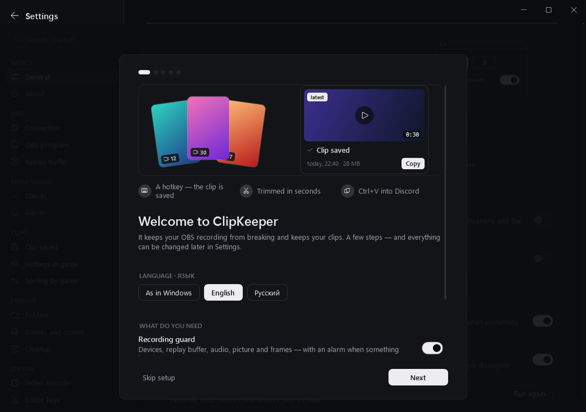 |
| **Settings** — tabs by topic, search (Ctrl+F) | |
| 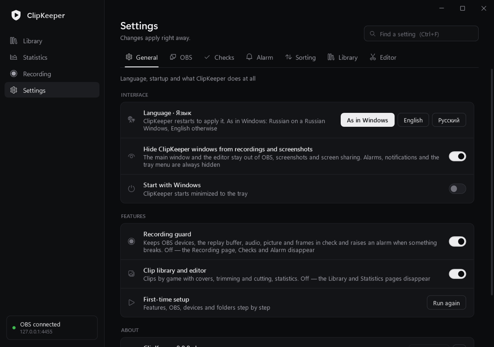 | |

<p align="center">
  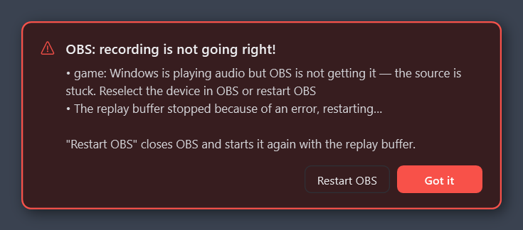
  &nbsp;
  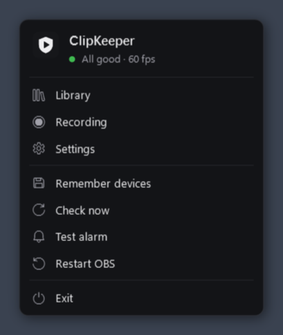
</p>

## Features at a glance

| 🛡 Recording guard | 🎬 Clip library and editor |
|---|---|
| Keeps OBS sources on the right audio devices and monitors | Saved clips go into the game's folder, with covers from Steam / Wikipedia |
| Restarts a crashed replay buffer, OBS itself after a crash | Sources → Ready → Collection: a clip's whole path |
| Notices audio that never reaches OBS and a black / frozen picture | Trim editor with Premiere keys (remappable) |
| Restores tracks in the OBS mixer, warns about mute and volume | Cut pieces from the middle, per-track volume and solo |
| Checks every saved clip: length, tracks, dropped frames | Lossless, frame-exact and share — or one click: Discord 10 MB / Nitro / Telegram, and the file is already copied |
| Alarm over the game: a window that doesn't steal focus, a sound | Every saved file is checked: length, video, audio in each track |
| Low disk space, graphics driver failures, daily OBS settings backup | Statistics by month and game, and a month recap to share as a picture |
| | Move the mouse over a clip — its frames scroll by |

The interface is in **English and Russian** (Settings → General → Language · Язык; by default it follows Windows).
ClipKeeper's own windows are hidden from OBS capture and screenshots, so they never end up in a clip.

## Install

1. Download `ClipKeeper-<version>.zip` from [Releases](https://github.com/Alukkart/ClipKeeper/releases/latest)
   and unpack it into a folder of your own (say `D:\Apps\ClipKeeper`) — ffmpeg is already inside. In a folder Windows
   protects (Program Files) it works too, keeping its data in `%LOCALAPPDATA%\ClipKeeper`, but can't update itself.
2. In OBS: **Tools → WebSocket Server Settings** — enable the server. The password is not needed: **Find OBS** in the setup
   takes it from the OBS settings on this computer.
3. Run `ClipKeeper.exe`. A short setup walks through language and features, the OBS connection, devices and folders.

<details>
<summary><b>Windows says "Windows protected your PC", or an antivirus complains</b></summary>

ClipKeeper is a new program from a small open-source project and its exe is not code-signed yet, so Windows SmartScreen
doesn't know it: press **More info → Run anyway**. To be sure the file is the one GitHub built from this source code,
compare its checksum with `SHA256SUMS.txt` from the same release: `Get-FileHash ClipKeeper.exe` in PowerShell.
You can also check it on [VirusTotal](https://www.virustotal.com).

Some antivirus heuristics dislike what a clip tool has to do. Here is all of it, and why:

| What | Why | When |
|---|---|---|
| Reads whether one key is pressed (`GetAsyncKeyState`), the way OBS itself does | Confirms a clip at the press of the OBS "Save Replay" key | Only that key, read from your OBS profile; nothing is stored or sent. Off: Settings → Checks → "Clip saved" |
| Global hotkeys (`RegisterHotKey`) | Trim / favorite / copy the last clip from the game | Only if you set them; none by default |
| Changes OBS files | Adds the "start ClipKeeper with OBS" script | Only if you turn it on; OBS closed; copies first |
| Downloads and replaces its own exe | Updates | Only from this repository's releases, checked against `SHA256SUMS.txt`, on your click |
| Starts and closes OBS | Restarting OBS after a crash, the restart button | Settings → OBS |

Every release is built by GitHub Actions from this repository (`.github/workflows/release.yml`) — nothing is added by hand.

</details>

**Update:** ClipKeeper checks GitHub once a day and says when a new version is out; **Settings → General → Update**
downloads it, checks it against the release checksums, swaps the exe and restarts. By hand: close ClipKeeper in the tray
and replace `ClipKeeper.exe` with the new one (it's attached to every release on its own). Settings, the device reference
and covers stay either way.

<details>
<summary><b>Setting it up by hand</b> (if you skipped the setup)</summary>

1. In OBS: Tools → WebSocket Server Settings — enable the server and set a password.
2. In ClipKeeper: Settings → OBS — enter the password and press **Save and reconnect**.
   The password is stored encrypted in `settings.json` (Windows DPAPI): only your Windows account can read it.
3. Set up your audio and screen sources in OBS and press **Remember current devices**.
4. Press **Test alarm**. The **Start with Windows** toggle turns on autostart.

**OBS running but ClipKeeper not?** Turn on **Settings → OBS → Start ClipKeeper together with OBS**: however OBS is started
(a shortcut, Steam, autostart), ClipKeeper starts too. It adds a small script to OBS — you see it in OBS → Tools → Scripts,
with a description — and turning the setting off removes it. OBS files are changed only while OBS is closed (OBS writes
them back on exit): if OBS is open, it is done the moment OBS closes, or press **Restart OBS now** right there. The scene
collections are copied to `backups\` before the change. A ClipKeeper that already runs is left as it is.

- ClipKeeper finds OBS by itself (registry or the standard install folder). If OBS lives elsewhere, choose `obs64.exe`
  in Settings → OBS — it's needed to start OBS again after a crash.
- The setup can be run again from Settings → General.

</details>

## How it works

<details>
<summary><b>🛡 Recording guard</b> — what is checked and what happens</summary>

| Check | What ClipKeeper does |
|---|---|
| **Devices** | Keeps audio (WASAPI) and screen capture sources on the devices from the reference. If an ID changed after an audio software update (SteelSeries GG, Voicemeeter…), a driver update or a monitor swap, it finds the device by name or monitor model and sets it again. Audio changes are reported by Windows at once; monitors are checked every 5 s and on display changes. |
| **Replay buffer** | Started again after an error (NVENC, driver). 3 crashes in 10 minutes — auto restart stops and an alarm goes up. |
| **OBS crash** | Alarm and a restart with `--startreplaybuffer --disable-shutdown-check`. If OBS hangs, the alarm has a **Restart OBS** button. |
| **Silent audio** | Windows shows a signal on the device, but the OBS meter stays at zero for over 8 s → the source is restarted once; if that doesn't help — alarm. |
| **Black / frozen picture** | Every 15 s a 64×36 snapshot of the capture. Black, white or single-color while the monitor shows a picture → capture restarted after 30 s, alarm after 60 s. No alarm if the monitor is dark too or you are away. |
| **Mixer** | Source tracks are restored automatically. Mute and volume shifts of 6 dB or more only get a warning (often changed on purpose), as does a changed track set in recording settings. |
| **Saved clips** | Length and track count after every save: a "Clip saved" card, or the same card in orange with the problem if the clip is short (with a hint about the memory limit) or misses tracks. |
| **Dropped frames** | OBS skipped-frame counters every 5 s (the same as in OBS Stats). Over 1% a minute → a yellow warning saying who can't keep up (rendering — the GPU is busy, or the encoder) and what to do; it holds until 3 clean minutes. In a clip: from 2% — "clip stutters", from 0.5% — a note. |
| **Other** | Graphics driver failures (Windows event log), low disk space for clips, a daily OBS settings backup to `backups\` (the last 7 kept). |

**Alarm:** a blinking red window over the game (doesn't steal focus), a sound every 15 s until you press **Got it**,
and a Windows notification. When things are fixed, a green window shows for 7 seconds. Volume and sound file are in
Settings → Alarm; the sound goes through the default Windows output device (for a virtual device such as SteelSeries
Sonar the alarm volume also depends on its channel there).

**Recording only, no replay buffer?** Turn off "I record with the replay buffer" in Settings → OBS:
buffer checks stop and OBS is started without it.

The monitor list comes from Windows, not from OBS: asking OBS for it blanks screen capture for 1–2 frames, so OBS
is asked only when a monitor really changed.

**Device reference** — `devices.json`. After you change a device in OBS on purpose, press **Remember current devices**
(or edit the source right in ClipKeeper — see Recording page below), otherwise the old one comes back.

</details>

<details>
<summary><b>🗂 Sorting by game</b> — what Smart Replay Mover did, without an OBS script</summary>

Turn on **Settings → Sorting → Sort clips by game**. Every replay (and, if you want, recordings and screenshots)
moves from the OBS folder into the game's folder the moment it's saved: `Hunt Showdown\2026-10\Hunt Showdown - Replay ….mp4`.

- **The game** is the window in front when you save. If it's Discord, a browser or the desktop, the last game you played
  is used while it still runs. A game is a program from Steam / Epic / GOG / Riot / Xbox, a fullscreen window, or one
  hidden by anti-cheat — so a maximized editor or chat never gets its own folder.
- **The name** comes from the store (Steam, Epic, GOG), then from the exe's properties, then from the exe name made
  readable. A folder that already exists for the game is used as is, including Smart Replay Mover's
  (`HuntGame - Replay …` files in `Hunt Showdown` mean HuntGame goes there).
- **Settings → Sorting**: the folder template (`{game}` `{type}` `{year}` `{month}` `{day}` `{date}`
  `{yearmonth}`), the game name in front of the file name, the folder for "no game", and your own names in Smart Replay
  Mover's format: `HuntGame > Hunt`, `+call duty > Call of Duty` (all words), `*minecraft* > Minecraft` (anywhere in the
  exe name or window title). **Check** shows which game is detected right now.
- **Moving from Smart Replay Mover:** its template, names and switches are taken over when you turn sorting on. Then
  remove the script in OBS → Tools → Scripts (ClipKeeper warns while it's still there) and, if you used its "Smart Save"
  key, set the same key in OBS → Settings → Hotkeys → Replay Buffer → **Save Replay**.
- It works while ClipKeeper runs — keep **Start with Windows** or **Start ClipKeeper together with OBS** on. Clips saved while it was closed stay in the OBS
  folder (the library shows them under "No folder").

</details>

<details>
<summary><b>📚 Library</b> — three folders, covers, collection</summary>

Clips come from three folders, following a clip's path:

| Folder | What's in it |
|---|---|
| **Sources** | OBS recordings, including game folders made by sorting (or Smart Replay Mover). Subfolders count as games; if you sort clips another way (by date…), turn that off in Settings → Library and the game is taken from the file name. |
| **Ready** | Trims waiting for a video — the folder the editor saves to. |
| **Collection** | Clips that made it into a video. Optional — Settings → Library. |

- Ready and Collection are chosen with the **+** button; right click it to change the folder.
- Each folder opens with cards: Favorites, All clips and games — cover, clip count, total length and size.
  With a single group (e.g. ready clips without game data) the clips are shown right away.
- **Covers** come from Steam, or from Wikipedia for non-Steam games (only an article about the game itself), and are
  kept in `covers\`. Hover a card to set your own cover. Turn online covers off in Settings → Library — then only your
  own pictures and clip frames are used.
- Inside a game: a banner on top (Steam art, or a blurred frame of the latest clip; can be replaced too).
  Back — the arrow, Backspace or the mouse back button.
- **Cleanup of old clips** (Settings → Library, off by default) moves source clips older than N days to the Recycle Bin.
  **Check** shows how many and the full list first; **To the Recycle Bin** needs a second press. It never touches favorites,
  trims, sources you have already trimmed (a setting), the Ready and Collection folders, or anything copied into the folder
  less than N days ago. Only local disks; if Windows would delete a file for good instead of recycling it, it asks. Without
  ffmpeg it refuses (it can't tell trims from sources). Once a day by itself if you turn that on — but it stops and asks
  if more than 300 clips or half of the folder would go. Every moved file is listed in `cleanup.log`.
- **Clip buttons:** ★ favorite, open, trim, show in folder, copy the file (then Ctrl+V into Discord / Telegram),
  move to the Recycle Bin (press twice).
- **To collection** (Ready clips): a known game goes into its collection folder (an existing folder is found even if
  spelled slightly differently); an unknown one opens a list of the collection's game folders.
  **All to collection** moves every clip with a known game and shows the plan first.
- **"Clip saved"** is a card in the top right corner: a frame of the clip, the game, length / tracks / size, how many clips
  are in that folder today and where it went, with **Open**, **Trim**, **Copy** (then Ctrl+V into Discord) and **Folder**.
  It stays while the mouse is over it and never takes focus from the game. A short sound of its own (not the alarm one)
  plays with it — or alone, if the card is off; the file and volume are set in **Settings → Checks → "Clip saved"**,
  like the alarm sound.
- **The press is confirmed at once.** OBS reports a clip only once the file is written (a second or more for a big
  buffer), so ClipKeeper also watches the OBS "Save Replay" key — read from the current OBS profile, polled like OBS does
  it, nothing taken from OBS: the sound and a "Saving the clip…" card come right at the press, the clip card replaces it
  when the file is ready. If OBS reports nothing in 30 s, the card says so. Can be turned off in the same place.

</details>

<details>
<summary><b>✂ Trim editor</b> — timeline, cuts, tracks, saving</summary>

<p align="center"></p>

Open it with the ✂ button on a clip. Left — video, controls and the timeline (ruler, filmstrip, waveform, time under
the cursor). Right — tracks and saving; the check result appears there too.

**One window for a whole session.** The editor stays open: the next clip you trim comes into the same window. ← → next
to the file name (or Ctrl + ← / →) go through the clips the library showed when you opened it (otherwise the clip's
folder, newest first), and after saving a big **Next clip** button takes you straight on. A clip whose source you
deleted is skipped. Edits that were not saved are never dropped silently: the first press only warns, and a clip opened
from the library asks "Open … ? The edits of this clip are not saved".

**Timeline**
- Zoom: Ctrl / Alt + wheel at the cursor, `=` / `−`, `\` — whole timeline. The wheel scrolls a zoomed timeline;
  the strip under it shows the visible part and can be dragged. During playback the timeline follows the playhead.
- The waveform is what you hear: all enabled tracks with their volume, or the chosen ones in solo.
- The list button under the timeline (or **T**) shows **each track in its own lane** instead of the combined
  waveform; disabled tracks are pale.

**Cut a piece from the middle** — the scissors button or **X**: press at the start of the piece and again at its end.
The piece turns red; its edges can be dragged. The ✕ on a cut or **Delete** (playhead inside) brings it back,
Ctrl+Z undoes the last cut, Esc drops an unfinished one. Cut parts are skipped while watching.

**Saving**

| Mode | What it does |
|---|---|
| **Lossless** | Copy without re-encoding: all tracks, almost instant; the start snaps to a keyframe. |
| **Frame-exact** | Video re-encoded on the GPU at the same quality, audio copied. |
| **Share** | H.264, one track — exactly what you hear. Discord (10 MB), Nitro (500 MB), **your own size in MB**, or Telegram (no limit). Small sizes lower the resolution. |

- With cuts the remaining pieces are joined frame-exactly (video re-encoded at frame-exact quality, a 10 ms
  crossfade at audio joints); the join's length and audio are checked before the usual check.
- **Every saved file is checked:** length, video readable start to end, track count and audio in each track
  (compared with the same range of the source).
- **Video encoder:** NVIDIA NVENC, AMD AMF or Intel Quick Sync is found automatically, or chosen in
  Settings → Editor; without one the CPU does the work.
- Trims go to Ready, or next to the source if no folder is chosen. **Delete the source** appears only after a
  successful check and moves the file to the Recycle Bin.
- **Smooth preview:** heavy video (HEVC, high bitrate) lags in the player, so a light 720p copy is made in the
  background (~10 s on the GPU) and the player switches to it seamlessly. The original is always what's saved.
  Copies live in `%TEMP%\dg_trim\proxy` — no more than 8, no older than 3 days.
- Mode, share target, volume and lanes are remembered; so are the window size and position.

<p align="center">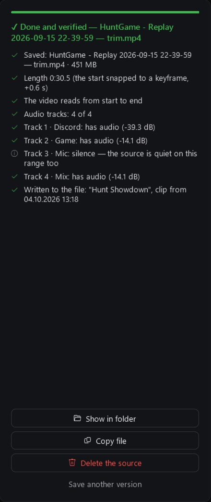</p>

</details>

<details>
<summary><b>⌨ Editor keys</b> — like Premiere, every key can be changed</summary>

<p align="center">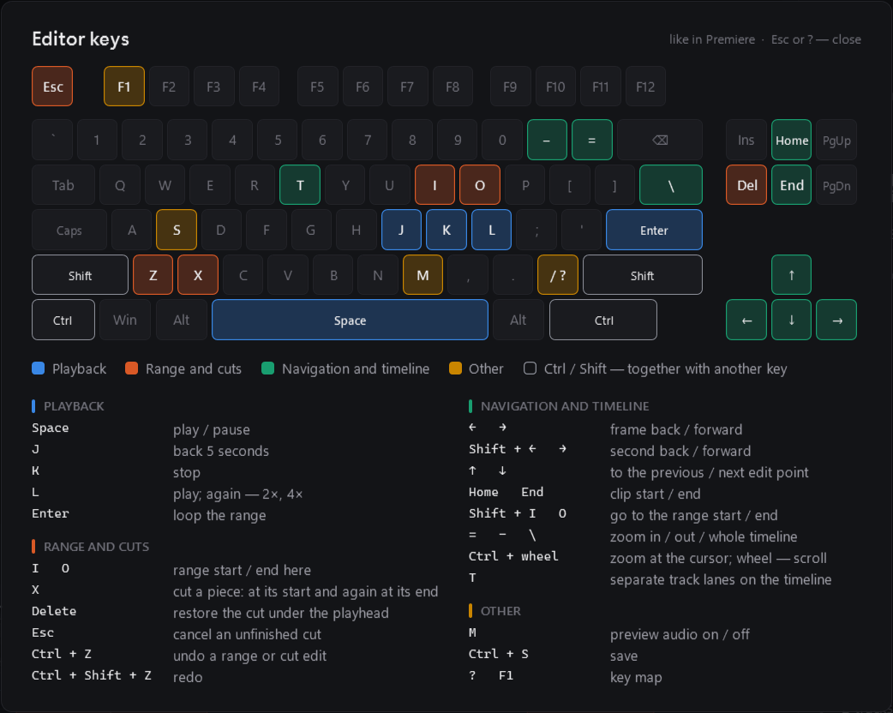</p>

| Key | Action | Key | Action |
|---|---|---|---|
| Space | play / pause | ← / → | a frame; with Shift — a second |
| J / K / L | back 5 s / stop / play (L again — 2×, 4×) | ↑ / ↓ | previous / next edit point |
| Enter | loop the range | Home / End | clip start / end |
| I / O | range start / end here | Shift + I / O | go to the range start / end |
| X | cut a piece (start, then end) | `=` / `−` / `\` | zoom in / out / whole timeline |
| Delete | restore the cut under the playhead | T | separate track lanes |
| Esc | cancel an unfinished cut | M | preview audio on / off |
| Ctrl + Z / Ctrl + Shift + Z | undo / redo | Ctrl + S | save |
| ? or F1 | key map | Ctrl + wheel | zoom at the cursor |

Change any key in **Settings → Editor**: click a key in the list and press a new one; a key that is already
taken swaps with it. Ctrl + Z / S, Ctrl + ← / → (previous / next clip), Esc and ? stay fixed. The map opens in the editor with `?`, F1 or the keyboard icon.

**Hotkeys in game** (Settings → Library) work while the game is in front: trim the last clip, put it in favorites, copy it
for Discord, show its card again. None is set by default; a combination needs Ctrl, Alt, Shift or Win, and one that another
program holds is reported instead of taken.

</details>

<details>
<summary><b>📈 Statistics</b> — what becomes of your clips</summary>

- Tiles: clips recorded (hours, GB), trimmed, kept untrimmed (and the space they take), deleted.
- Charts: **Clips by month**, **By game** (trimmed / kept / deleted) and **Ready clips by month**; exact numbers on hover.
- *Trimmed* — a trim was made from the clip in ClipKeeper (trims from Premiere don't remember their source).
- *Deleted* — the clip is in neither Sources nor Ready. Counted from the day ClipKeeper started logging every saved
  clip; the history accumulates in `clipstats.json`.
- Until OBS is connected and the sources folder is known, nothing is counted — so nothing is mistaken for deleted.

</details>

<details>
<summary><b>🪟 Window, tray and settings</b></summary>

**Tray icon:** 🟢 all good · 🟡 glitch, waiting for recovery / buffer turned off by hand · 🔴 alarm · ⚪ OBS not running
(or the guard is off). Click — open the window; right click — a menu with the status, shortcuts and quick actions
("Restart OBS" works on the second press). Launching `ClipKeeper.exe` again opens the running copy's window.

**Window:** Library, Statistics, Recording, Settings. It opens on the library, or straight on Recording if there's
a problem; a dot next to Recording shows it (red — problem, yellow — attention).

**Recording page:** the overall status and tiles (OBS fps and dropped frames, buffer, audio, screen, disk, last clip);
below — the sources (the device reference): **Edit** changes device, tracks, volume and mute right in OBS and
remembers them, so ClipKeeper won't roll them back; at the bottom — the log and actions. A problem has a link to what fixes it
(its source card or the setting), and the OBS, buffer and disk tiles open their settings.

**Settings** — tabs by topic and a search over every setting (Ctrl+F); changes apply right away (Save is only for the connection).
Tabs of a turned-off feature disappear:

| Tab | What's there |
|---|---|
| General | Language · Язык, hide windows from capture, start with Windows; features (recording guard, library and editor), run the setup again; version, updates and log |
| OBS | Connection status; WebSocket address, port, password; OBS program path, start ClipKeeper together with OBS, crash restart, OBS backup; replay buffer or regular recording and buffer options |
| Checks | Audio, picture, monitors, mixer, dropped frames, driver failures; clip checks, disk space; "Clip saved" card and its sound (file, volume) |
| Alarm | Wait before the alarm, "tell me when fixed"; window, sound, volume, sound file, repeat; test alarm |
| Sorting | Sort clips by game; Smart Replay Mover warning; folder template, game name in the file name, folder when there is no game; replays, recordings, screenshots; your game names, "which game is it now" |
| Library | Sources, Ready, Collection; hotkeys in game; "subfolders are games", online covers; cleanup of old clips |
| Editor | Video encoder; the key map, every key can be changed |

</details>

## Privacy

ClipKeeper has no accounts, no telemetry and no ads. Everything it learns stays on your computer: settings, the device
reference, the clip cache, favorites, statistics and the log live next to `ClipKeeper.exe` (or in
`%LOCALAPPDATA%\ClipKeeper` if that folder is read-only). Your OBS WebSocket password is stored encrypted with Windows
(DPAPI), readable only by your Windows account.

It connects to:

| Where | What for | Turn off |
|---|---|---|
| OBS WebSocket (your own computer by default) | Everything about recording | — |
| Steam, Wikipedia | Game covers and banners: the game name is searched | Settings → Library → Covers from the internet |
| GitHub | Once a day: is there a new version | Settings → General → Check for updates |

**Report a problem** only opens a GitHub form in your browser — you see everything before posting. The log has folder,
game and device names: look it over before attaching it.

## Code signing policy

*Applied for; until it is approved, releases stay unsigned.*

Free code signing provided by [SignPath.io](https://about.signpath.io/), certificate by
[SignPath Foundation](https://signpath.org/).

Only `ClipKeeper.exe` from this repository is signed, built by GitHub Actions ([`release.yml`](.github/workflows/release.yml))
from a release tag; every signing request is approved by hand.

| Role | Who |
|---|---|
| Committers and reviewers | [Alukkart](https://github.com/Alukkart) |
| Approvers | [Alukkart](https://github.com/Alukkart) |

Privacy: ClipKeeper sends nothing about you or your computer anywhere; the only connections it makes are listed in
[Privacy](#privacy), and each of the internet ones can be turned off.

## License

ClipKeeper is free and open source under the [MIT license](LICENSE): use it, change it, share it — keep the copyright
notice. It comes without any warranty.

The release zip also contains **ffmpeg** — a separate program under the GPL, which ClipKeeper runs for trimming and
previews; its license is in `ffmpeg\LICENSE.txt`, its source code at
[BtbN/FFmpeg-Builds](https://github.com/BtbN/FFmpeg-Builds) and [ffmpeg.org](https://ffmpeg.org).

## Build and release

<details>
<summary>Build from source, run the tests, publish a version</summary>

- **Build:** `build.cmd` — the C# compiler that ships with Windows (.NET Framework 4.8), nothing to install.
  `build.cmd ClipKeeper.test.exe` builds under another name without touching the working exe.
  A local build calls itself `0.0.0-dev`; the interface is WPF, also part of Windows.
- **ffmpeg** for running locally: `ffmpeg.exe` and `ffprobe.exe` from a [BtbN build](https://github.com/BtbN/FFmpeg-Builds/releases)
  (`ffmpeg-master-latest-win64-gpl.zip`, the `bin` folder) go into `ffmpeg\` next to the exe. They're not in git.
- **GitHub Actions** (`.github/workflows/`):
  - `build.yml` — every push to `main` and every pull request: build + `--selftest`; the exe is in the run artifacts;
  - `release.yml` — a `v*` tag: build with the tag's version, self-test, a zip with ffmpeg, `ClipKeeper.exe` for
    updates, `SHA256SUMS.txt` and a release with the change list. A tag with a hyphen (`v1.1.0-beta.1`) is a pre-release.
    **Code signing** goes through [SignPath](https://signpath.org/) and is optional: with the repository variable
    `SIGNPATH_ORGANIZATION_ID` and the secret `SIGNPATH_API_TOKEN` the built exe goes to SignPath, waits there for a manual
    approval (up to an hour) and comes back signed before the self-test and the checksums. The SignPath project uses
    [`.signpath/artifact-configuration.xml`](.signpath/artifact-configuration.xml). Without them the exe stays unsigned
    and SmartScreen warns on first start.
- **Release a version:**

  ```bash
  git tag v1.1.0
  ```

  ```bash
  git push origin v1.1.0
  ```

**Command line**

| Command | What it does |
|---|---|
| `ClipKeeper.exe --tray` | start minimized to the tray (used by autostart) |
| `--selftest [file]` | self-test without OBS: the logic, and every window built off screen with default settings |
| `--preview <folder> [--lang en\|ru]` | render every screen to PNG (design checks, these screenshots) |
| `--preview-settings <folder> [--lang en\|ru]` | the settings tabs and the Recording page with default settings, no folders needed. The Build workflow run by hand with **screenshots** commits `docs/screenshots/<lang>/settings.png` |
| `--playtest <clip> <report>` | run the editor player muted and offscreen: seeks, a track change, closing |
| `--keytest <clip> <report>` | press every editor key in an offscreen editor and check the result |
| `--trimtest <clip> <folder> <report>` | save in every mode, with cuts and a mix rebuild, and check the files |
| `--probe [file]` | check that the OBS WebSocket answers (no password sent) |

**Files**

| Path | What it is |
|---|---|
| `src/*.cs`, `ui/*.xaml`, `src/app.ico` | sources, window markup, the icon |
| `src/Lang.cs` | interface language: `L.T("English", "Русский")` in code, `"English¦Русский"` in XAML |
| `src/AssemblyInfo.cs` | the version (set by the release from the tag) |
| `settings.json`, `devices.json` | settings (password encrypted) and the device reference — next to the exe, not in git |
| `ClipKeeper.log` | the log |
| `covers\`, `favorites.json`, `clipcache.json`, `clipstats.json` | covers and banners (`custom\` — your own), favorites, clip cache, statistics history |

</details>
