<p align="center">
  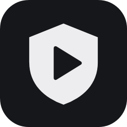
</p>

<h1 align="center">ClipKeeper</h1>

<p align="center">
  <b>Помощник OBS в трее: следит, чтобы запись не сломалась, и хранит клипы.</b><br>
  Наблюдение за записью · библиотека клипов · редактор обрезки · статистика
</p>

<p align="center">
  <a href="README.md">English</a> · <b>Русский</b>
  &nbsp;|&nbsp;
  <a href="https://github.com/Alukkart/ClipKeeper/releases/latest"><b>⬇ Скачать</b></a>
  &nbsp;|&nbsp;
  Windows 10 / 11 · OBS 28+
</p>

<p align="center">
  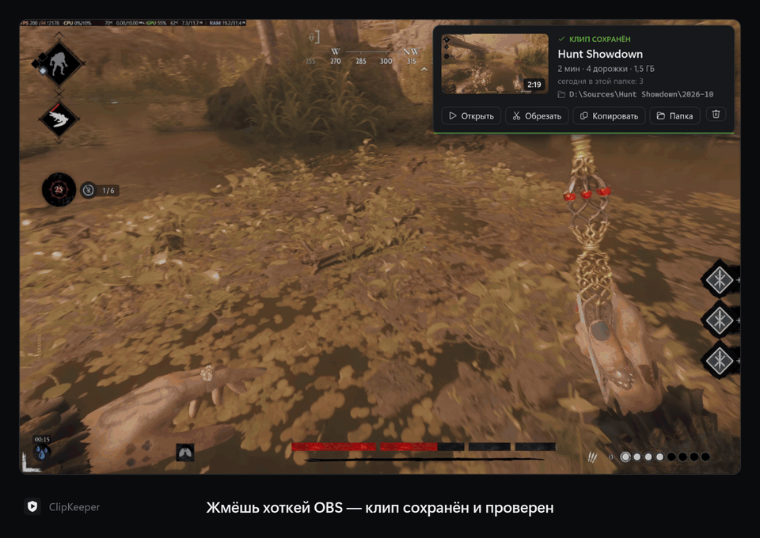
</p>

---

## Зачем

Ты пишешь буфером повтора OBS и жмёшь клавишу, когда случилось что-то интересное. ClipKeeper следит, чтобы клип
действительно получился — с нужными устройствами, всеми дорожками звука и живой картинкой, — а потом помогает
его найти, обрезать и отправить.

- **Наблюдает за записью** снаружи, через obs-websocket, и сам чинит то, что ломается: потерянные устройства после
  обновления драйвера или звуковой программы, упавший буфер повтора, замолчавший источник, чёрный экран.
- **Хранит клипы**: библиотека по играм с обложками, редактор с точной обрезкой, вырезами и громкостью по дорожкам,
  статистика того, что записываешь и что оставляешь.

Обе половины работают и по отдельности — ненужную можно выключить в **«Настройки → Общие»**.

## Скриншоты

| Библиотека по играм | Клипы игры |
|:---:|:---:|
| 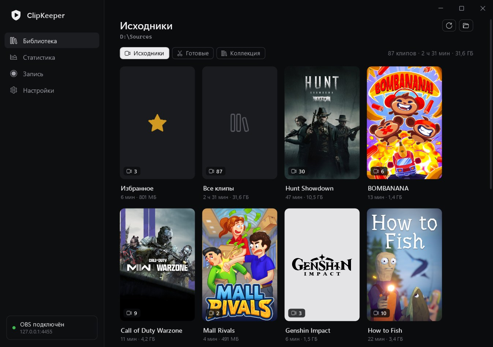 | 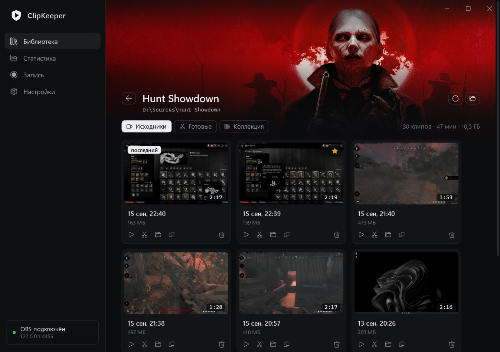 |
| **Редактор** — вырезы, дорожки по отдельности | **Наблюдение за записью** — состояние, плитки, источники |
| 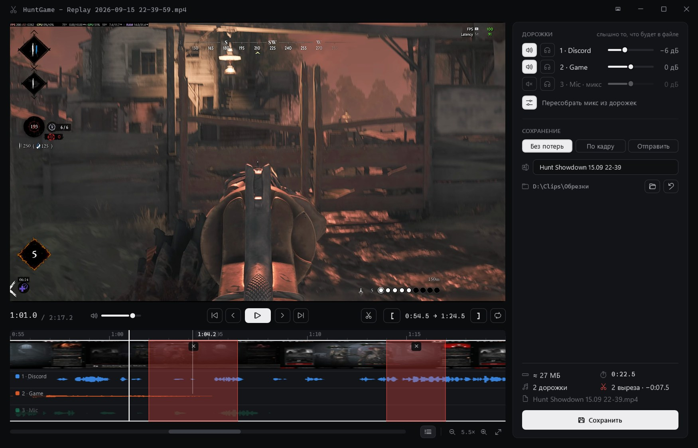 | 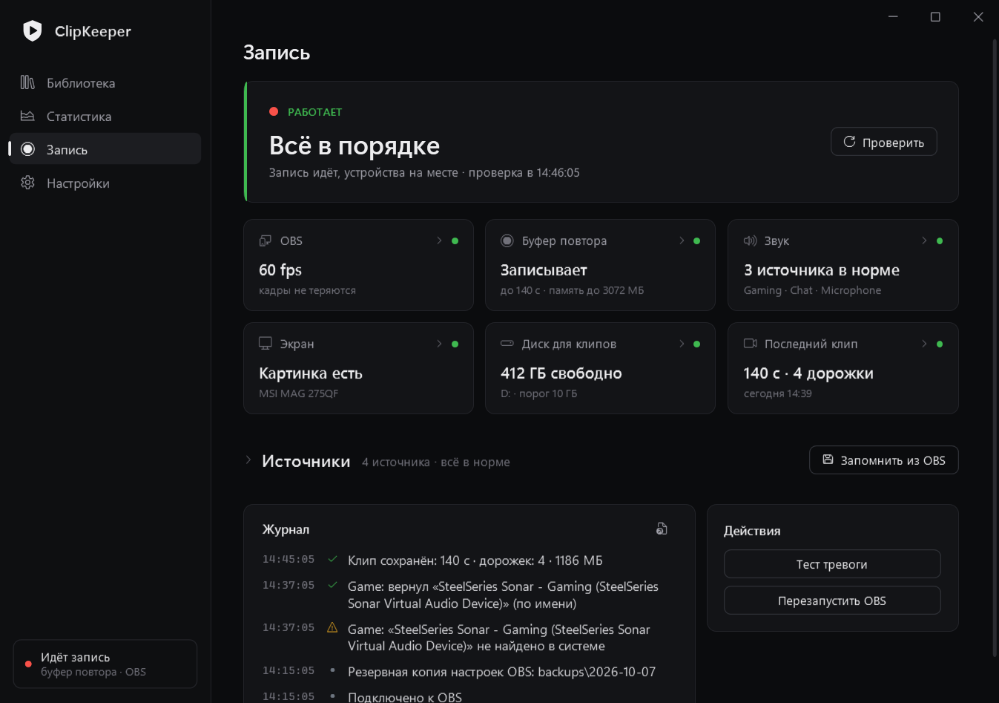 |
| **Когда что-то сломалось** — что не так и ссылка на то, что чинит | **Статистика** — итоги месяца и что стало с клипами |
| 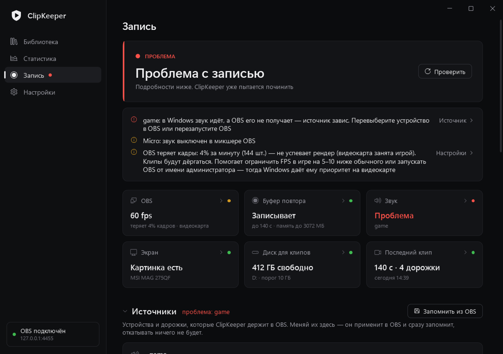 | 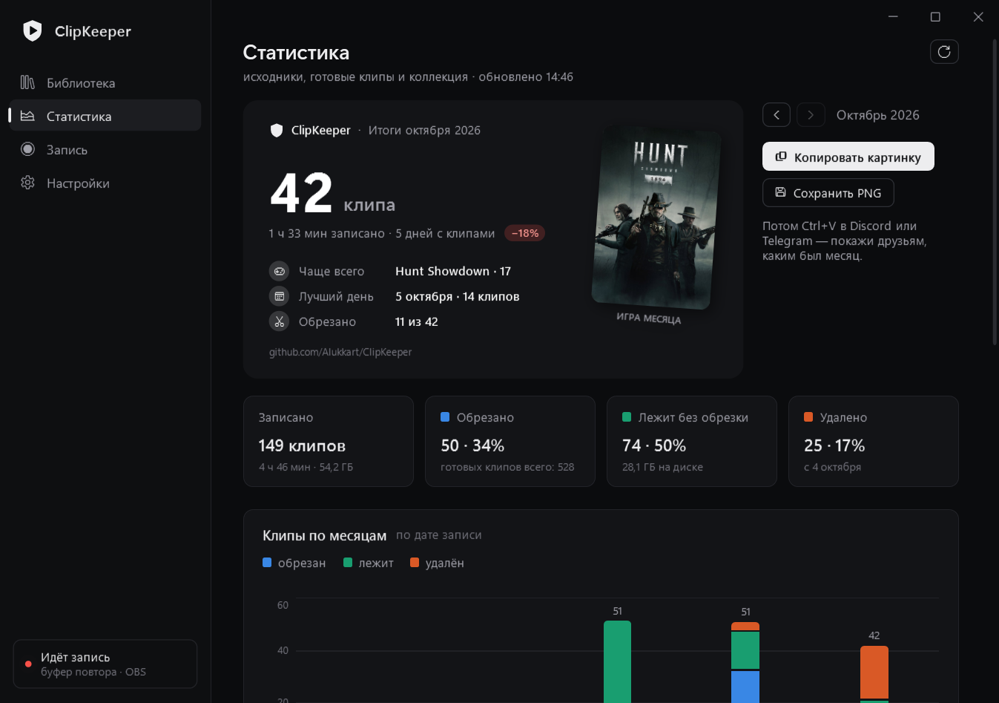 |
| **Настройки** — разделы по группам, поиск (Ctrl+F) | **Первая настройка** |
| 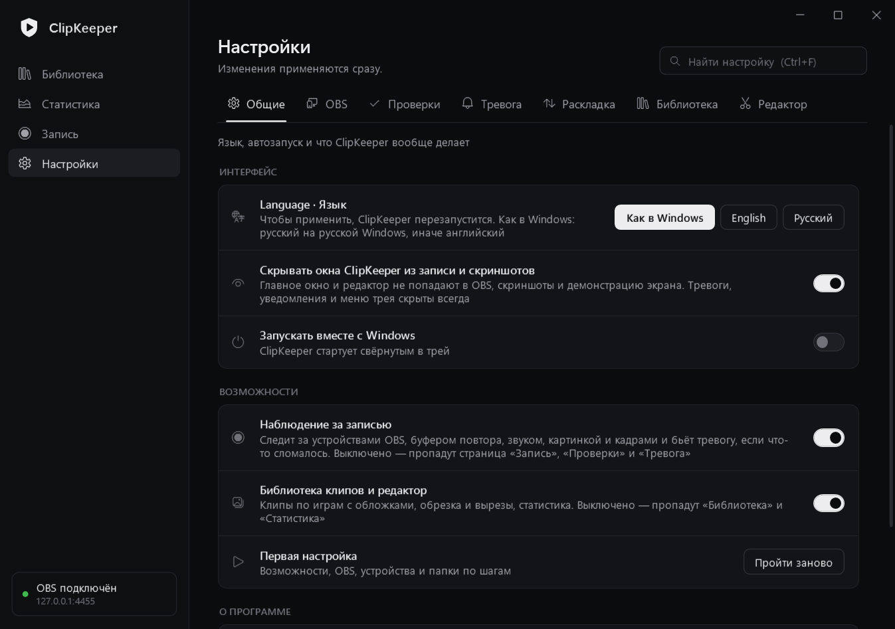 | 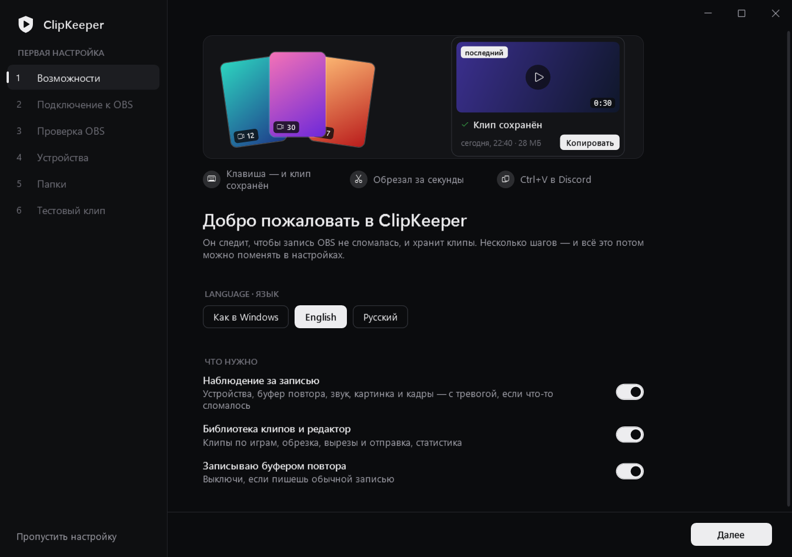 |

**Поверх игры** — карточки и тревога не забирают фокус у игры, и ничто из этого не попадает в запись:

| **«Клип сохранён»** — кадр, длина, дорожки; открыть, обрезать, скопировать | **Сохранён с проблемой** — что не так и что делать |
|:---:|:---:|
| 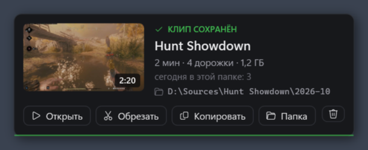 | 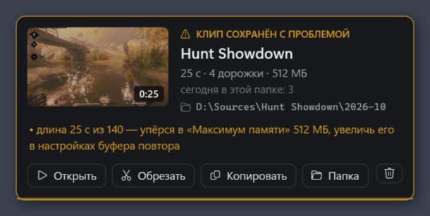 |
| **Тревога** — звук, пока не нажмёшь «Понял» | **Меню в трее** — состояние и быстрые действия |
| 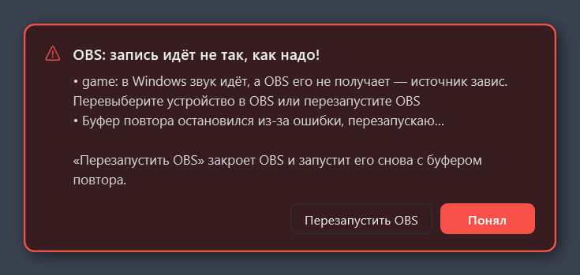 | 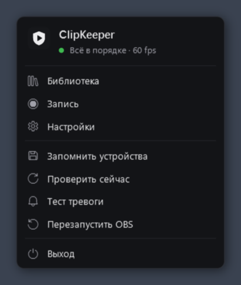 |

## Возможности коротко

| 🛡 Наблюдение за записью | 🎬 Библиотека и редактор |
|---|---|
| Держит источники OBS на нужных звуковых устройствах и мониторах | Сохранённые клипы сами попадают в папку игры, обложки из Steam и Википедии |
| Перезапускает упавший буфер повтора и сам OBS после падения | Исходники → Готовые → Коллекция: весь путь клипа |
| Замечает звук, который не доходит до OBS, и чёрную или застывшую картинку | Редактор с клавишами как в Premiere (можно менять) |
| Возвращает дорожки в микшере OBS, предупреждает о выключенном звуке и громкости | Вырезы из середины, громкость и соло по дорожкам |
| Проверяет каждый сохранённый клип: длина, дорожки, потерянные кадры | Без потерь, по кадру и для отправки — или в один клик: Discord 10 МБ / Nitro / Telegram, и файл уже скопирован |
| Тревога поверх игры: окно, которое не забирает фокус, и звук | Каждый сохранённый файл проверяется: длина, видео, звук в каждой дорожке |
| Мало места на диске, сбои драйвера видеокарты, ежедневная копия настроек OBS | Статистика по месяцам и играм и итоги месяца — картинкой, чтобы поделиться |
| | Наведи мышь на клип — пробегут его кадры |

Интерфейс на **английском и русском** («Настройки → Общие → Language · Язык», по умолчанию — как в Windows).
Окна ClipKeeper скрыты от захвата OBS и скриншотов, поэтому в клип они не попадают.

## Установка

1. Скачай `ClipKeeper-<версия>.zip` со страницы [Releases](https://github.com/Alukkart/ClipKeeper/releases/latest)
   и распакуй в свою папку (например, `D:\Apps\ClipKeeper`) — ffmpeg уже внутри. В папке, которую защищает Windows
   (Program Files), программа тоже работает — данные хранит в `%LOCALAPPDATA%\ClipKeeper`, — но не может обновиться сама.
2. В OBS: **«Сервис → Настройки сервера WebSocket»** — включи сервер. Пароль копировать не нужно: **«Найти OBS»**
   в первой настройке возьмёт его из настроек OBS на этом компьютере.
3. Запусти `ClipKeeper.exe`. Короткая настройка проведёт через язык и возможности, подключение к OBS, проверку того, что
   нужно OBS для клипов (сервер WebSocket, буфер повтора, клавиша «Сохранить повтор» — каждое исправляется кнопкой),
   устройства и папки, а закончится пробным клипом: нажмёшь свою клавишу и увидишь, какую карточку получает клип.

<details>
<summary><b>Windows пишет «Система Windows защитила ваш компьютер» или ругается антивирус</b></summary>

ClipKeeper — новая программа небольшого проекта с открытым кодом, и её exe пока не подписан, поэтому Windows SmartScreen
её не знает: нажми **«Подробнее → Выполнить в любом случае»**. Чтобы убедиться, что файл — тот самый, который GitHub
собрал из этого кода, сравни его контрольную сумму с `SHA256SUMS.txt` из того же релиза: `Get-FileHash ClipKeeper.exe`
в PowerShell. Можно проверить и на [VirusTotal](https://www.virustotal.com).

Эвристике некоторых антивирусов не нравится то, что приходится делать программе для клипов. Вот всё это и зачем:

| Что | Зачем | Когда |
|---|---|---|
| Узнаёт, нажата ли одна клавиша (`GetAsyncKeyState`), так же, как сам OBS | Подтвердить клип в момент нажатия клавиши «Сохранить повтор» из OBS | Только эта клавиша из профиля OBS; ничего не сохраняется и не отправляется. Выключается: «Настройки → Клип сохранён → Подтверждать нажатие сразу» |
| Глобальные горячие клавиши (`RegisterHotKey`) | Обрезать / в избранное / скопировать последний клип из игры | Только если ты их назначил; по умолчанию нет ни одной |
| Меняет файлы OBS | Добавить скрипт «запускать ClipKeeper вместе с OBS»; в проверке при настройке — включить сервер WebSocket или буфер повтора, назначить клавишу «Сохранить повтор» | Только если включишь или нажмёшь «Исправить»; при закрытом OBS; сначала копия в `backups\` |
| Скачивает и заменяет свой exe | Обновление | Только из релизов этого репозитория, со сверкой с `SHA256SUMS.txt`, по твоему нажатию |
| Запускает и закрывает OBS | Перезапуск OBS после падения, кнопка перезапуска | «Настройки → Программа OBS» |

Каждый релиз собирает GitHub Actions из этого репозитория (`.github/workflows/release.yml`) — руками ничего не добавляется.

</details>

**Обновление:** ClipKeeper раз в день проверяет GitHub и сообщает о новой версии; **«Настройки → О программе → Обновить»**
скачивает её, сверяет с контрольными суммами выпуска, подменяет exe и перезапускается. Вручную: закрой ClipKeeper в трее
и замени `ClipKeeper.exe` новым (он лежит в каждом релизе отдельным файлом). Настройки, эталон устройств и обложки
останутся в любом случае.

<details>
<summary><b>Настройка вручную</b> (если начальную настройку пропустил)</summary>

1. В OBS: «Сервис → Настройки сервера WebSocket» — включи сервер и задай пароль.
2. В ClipKeeper: «Настройки → Подключение» — введи пароль и нажми **«Сохранить и переподключиться»**.
   Пароль хранится в `settings.json` в зашифрованном виде (Windows DPAPI): прочитать его можно только под твоей
   учётной записью Windows.
3. Настрой в OBS источники звука и экрана и нажми **«Запомнить текущие устройства»**.
4. Нажми **«Тест тревоги»**. Переключатель **«Запускать вместе с Windows»** включает автозапуск.

**OBS запущен, а ClipKeeper нет?** Включи **«Настройки → Программа OBS → Запускать ClipKeeper вместе с OBS»**: как бы ни запустили OBS
(ярлык, Steam, автозапуск), ClipKeeper запустится тоже. В OBS добавляется маленький скрипт — он виден в OBS → Сервис →
Скрипты, с описанием, — а если выключить настройку, он уберётся. Файлы OBS меняются, только пока OBS закрыт (при выходе
OBS записывает их заново): если OBS открыт, это произойдёт в момент его закрытия, или нажми там же **«Перезапустить OBS
сейчас»**. Перед изменением коллекции сцен копируются в `backups\`. Уже запущенный ClipKeeper остаётся как есть.

- OBS ClipKeeper находит сам (реестр или стандартная папка установки). Если OBS стоит в другом месте, укажи `obs64.exe`
  в «Настройках → Программа OBS» — это нужно, чтобы запускать OBS заново после падения.
- Начальную настройку можно пройти заново в «Настройках → Общие».

</details>

## Как это работает

<details>
<summary><b>🛡 Наблюдение за записью</b> — что проверяется и что происходит</summary>

| Проверка | Что делает ClipKeeper |
|---|---|
| **Устройства** | Держит источники звука (WASAPI) и захвата экрана на устройствах из эталона. Если ID сменился после обновления звуковой программы (SteelSeries GG, Voicemeeter…), драйвера или переключения мониторов, находит устройство по имени или модели монитора и ставит заново. Об изменениях звука Windows сообщает сразу, мониторы проверяются раз в 5 с и при смене настроек экрана. |
| **Буфер повтора** | Запускается снова после ошибки (NVENC, драйвер). 3 падения за 10 минут — автозапуск прекращается, сразу тревога. Если OBS потерял видеокарту (обновление или сбой драйвера: запись белая, буфер остановился) — тревога, и OBS перезапускается, когда установка драйвера закончится. |
| **Падение OBS** | Тревога и перезапуск с `--startreplaybuffer --disable-shutdown-check`. Если OBS завис, в окне тревоги есть кнопка **«Перезапустить OBS»**. |
| **Тихий звук** | Windows показывает сигнал на устройстве, а индикатор в OBS стоит на нуле дольше 8 с → источник один раз перезапускается; не помогло — тревога. |
| **Чёрная / застывшая картинка** | Раз в 15 с снимок захвата 64×36. Чёрный, белый или одноцветный, а на мониторе картинка есть → через 30 с перезапуск захвата, через 60 с тревога. Если монитор тоже тёмный или тебя нет за компьютером — тревоги нет. |
| **Микшер** | Дорожки источников возвращаются сами. О выключенном звуке и сдвиге громкости на 6 дБ и больше — только предупреждение (их часто меняют специально), как и об изменённом наборе дорожек в настройках записи. |
| **Сохранённые клипы** | Длина и число дорожек после каждого сохранения: карточка «Клип сохранён» или та же карточка оранжевым с проблемой, если клип короче (с подсказкой про лимит памяти) или в нём не хватает дорожек. |
| **Потерянные кадры** | Счётчики пропущенных кадров OBS раз в 5 с (те же, что в «Статистике» OBS). Больше 1% за минуту → жёлтое предупреждение: кто не успевает (рендер — видеокарта занята игрой, или кодировщик) и что делать; держится, пока 3 минуты не будет чисто. В клипе: от 2% — «клип дёргается», от 0,5% — пометка. |
| **Прочее** | Сбои и установка драйвера видеокарты (журнал Windows), мало места на диске для клипов, ежедневная копия настроек OBS в `backups\` (хранятся 7 последних). |

**Тревога:** мигающее красное окно поверх игры (фокус не забирает), звук каждые 15 с до нажатия **«Понял»** и
уведомление Windows. Когда всё починилось, на 7 секунд появляется зелёное окно. Звук и громкость — в
«Настройки → Тревога»: четыре встроенных звука или свой — любой аудиофайл (WAV, MP3, OGG, M4A…, берутся первые 10 с;
всё, кроме WAV, — через ffmpeg, он есть в архиве). Звук идёт через устройство вывода Windows по умолчанию (если это виртуальное устройство вроде
SteelSeries Sonar, громкость тревоги зависит ещё и от его канала).

**Пишешь обычной записью, без буфера повтора?** Выключи «Записываю буфером повтора» в «Настройках → Буфер повтора»:
проверки буфера прекратятся, а OBS будет запускаться без него.

Список мониторов берётся у Windows, а не у OBS: запрос списка у OBS на 1–2 кадра гасит захват экрана, поэтому OBS
спрашивается только тогда, когда монитор действительно сменился.

**Эталон устройств** — `devices.json`. Если намеренно сменил устройство в OBS, нажми **«Запомнить текущие устройства»**
(или поменяй источник прямо в ClipKeeper — см. страницу «Запись» ниже), иначе вернётся прежнее.

</details>

<details>
<summary><b>🗂 Раскладка по играм</b> — клипы по папкам игр, без скриптов в OBS</summary>

Включи **«Настройки → Раскладка по играм → Раскладывать клипы по играм»**. Каждый повтор (по желанию — и записи, и скриншоты)
в момент сохранения переезжает из папки OBS в папку игры: `Hunt Showdown\2026-10\Hunt Showdown - Replay ….mp4`.

- **Игра** — окно впереди в момент сохранения. Если это Discord, браузер или рабочий стол — последняя игра, пока она
  ещё запущена. Игрой считается программа из Steam / Epic / GOG / Riot / Xbox, окно на весь монитор или процесс,
  закрытый античитом, — так что развёрнутый редактор или чат не получит свою папку.
- **Название** берётся из магазина (Steam, Epic, GOG), затем из свойств exe, затем из имени exe в читаемом виде.
  Уже существующая папка игры используется как есть
  (файлы `HuntGame - Replay …` в папке `Hunt Showdown` значат, что HuntGame идёт туда).
- **«Настройки → Раскладка по играм»**: шаблон папок (`{game}` `{type}` `{year}` `{month}` `{day}` `{date}`
  `{yearmonth}`), название игры в начале имени файла, папка для «игры нет» и свои названия:
  `HuntGame > Hunt`, `+call duty > Call of Duty` (все слова), `*minecraft* > Minecraft` (где угодно в имени exe или
  заголовке окна). Кнопка **«Проверить»** показывает, какая игра определяется прямо сейчас.
- **Другой скрипт раскладки в OBS:** пока он подключён, ClipKeeper предупреждает — оба будут перемещать одни и те же
  файлы. Убери его в OBS → Сервис → Скрипты и, если сохранял клипы его клавишей, назначь ту же клавишу в OBS →
  Настройки → Горячие клавиши → Буфер повтора → **«Сохранить повтор»**.
- Работает, пока запущен ClipKeeper, — оставь включённым **«Запускать вместе с Windows»** или **«Запускать ClipKeeper вместе с OBS»**. Клипы, сохранённые, пока он
  был закрыт, остаются в папке OBS (в библиотеке — в «Без папки»).

</details>

<details>
<summary><b>📚 Библиотека</b> — три папки, обложки, коллекция</summary>

Клипы берутся из трёх папок — по пути клипа:

| Папка | Что в ней |
|---|---|
| **Исходники** | Записи OBS вместе с папками игр от раскладки. Подпапки считаются играми; если раскладываешь клипы иначе (по датам…), выключи это в «Настройках → Игры и обложки» — тогда игра берётся из имени файла. |
| **Готовые** | Обрезки, которые ждут выпуска, — сюда же сохраняет редактор. |
| **Коллекция** | Клипы, которые вошли в выпуск. По желанию — «Настройки → Папки». |

- «Готовые» и коллекцию выбирают кнопкой **+**, сменить папку — правым кликом по кнопке.
- В каждой папке сначала карточки: «Избранное», «Все клипы» и игры — обложка, число клипов, общая длина и размер.
  На «Избранном» и «Всех клипах» веером лежат кадры последних клипов поверх размытой копии самого нового.
  Если группа одна (например, все готовые без данных об игре), сразу показываются клипы.
- **Поиск, фильтры и порядок** над клипами: поиск по названию, игре или дате — «мост», «вчера», «5 октября», «05.10»
  (Ctrl+F); фильтры *Избранное*, *Не обрезаны* и *Старше месяца*; порядок — сначала новые, старые, длинные или большие.
  Клипы по дате разбиты на дни («Сегодня», «Вчера», «5 октября»…). С главной библиотеки — или кнопкой **«Искать во всех
  папках»** из игры — поиск идёт сразу по исходникам, готовым и коллекции, с разбивкой по папкам.
- **Названия:** F2 над карточкой или двойной клик по названию, потом Enter. Название попадает в имя файла, поэтому видно и
  в проводнике, и в Discord, и в Telegram: у исходника вокруг него остаются игра и время (`Hunt Showdown - Дуэль на мосту -
  2026-10-05 19-56-05.mp4`), у готового клипа имя — это название. Звёздочка, статистика и «последний клип» идут за файлом.
- **Несколько сразу:** Ctrl+клик или кружок на карточке выделяет клип, Shift+клик — несколько подряд, Ctrl+A — все
  видимые, Esc — снять. Внизу панель: сколько выбрано, общая длина и размер, и действия — в избранное, копировать
  (в Discord вставятся несколькими вложениями), в коллекцию для готовых, в корзину (нажать дважды) и **«Склеить»**.
- **Склейка:** два и больше выделенных клипа становятся одним — в том порядке, в каком выделял (карточку можно
  перетащить или подвинуть её кнопками ‹ ›); клик по карточке берёт из клипа только кусок, выбранный двумя ползунками на
  его кадрах. Встык или с затуханием 0,3 с, в качестве «По кадру» или под Discord / Nitro / Telegram; сохраняется в
  «Готовые», рядом с первым клипом или в выбранную папку и проверяется, как обрезка. Клипы другого размера или частоты кадров приводятся к первому; от каждого берётся общий микс.
- **Разбор новых клипов:** когда накопились клипы за последние две недели без звёздочки, обрезки и просмотра, в исходниках
  появляется **«Разобрать N новых»**. Клипы идут по одному и сами проигрываются, решение — одной клавишей: **F** — оставить
  со звёздочкой, **X** — обрезать потом, **Delete** — в корзину, **→** — пропустить, **Z** — отменить, **пробел** — пауза.
  По дороге ничего не удаляется: в конце отмеченные уходят в корзину одной кнопкой, а те, что обрезать, открываются в
  редакторе друг за другом.
- **Обложки** берутся из Steam, а для игр не из Steam — из Википедии (только статья именно про игру); хранятся в
  `covers\`. При наведении на карточку можно поставить свою. Обложки из интернета выключаются в «Настройках → Игры и обложки»,
  тогда остаются только свои картинки и кадры из клипов.
- Внутри игры сверху баннер (арт из Steam или размытый кадр последнего клипа; тоже можно заменить).
  Назад — стрелкой, Backspace или боковой кнопкой мыши.
- **Уборка старых клипов** («Настройки → Уборка», по умолчанию выключена) переносит исходники старше N дней в корзину.
  **«Проверить»** сначала показывает, сколько и полный список; **«В корзину»** срабатывает со второго нажатия. Никогда не
  трогает избранное, обрезки, исходники, из которых уже сделана обрезка (настраивается), папки «Готовые» и «Коллекция» и всё,
  что скопировано в папку меньше N дней назад. Только локальные диски; если Windows хочет удалить файл насовсем, а не в
  корзину, — она спросит. Без ffmpeg отказывается (не отличить обрезки от исходников). Раз в день сама, если включить, —
  но остановится и спросит, если уйти должно больше 300 клипов или половина папки. Каждый файл записывается в `cleanup.log`.
- **Кнопки клипа:** ★ избранное, открыть, обрезать, показать в папке, скопировать файл (потом Ctrl+V в Discord /
  Telegram), в корзину (нажать дважды).
- **В коллекцию** (у готовых): известная игра — сразу в её папку коллекции (существующая папка находится, даже если
  название записано чуть иначе); неизвестная — откроется список папок игр коллекции.
  **«Всё в коллекцию»** переносит все клипы с известной игрой и сначала показывает план.
- **«Клип сохранён»** — карточка в правом верхнем углу: кадр из клипа, игра, длина / дорожки / размер, сколько клипов
  сегодня в этой папке и куда он попал, с кнопками **Открыть**, **Обрезать**, **Копировать** (потом Ctrl+V в Discord) и
  **Папка**. Пока на ней мышь, она не исчезает, и фокус у игры не забирает. С ней звучит свой короткий звук (не тот, что
  у тревоги) — или только он, если карточка выключена: один из четырёх встроенных (Маримба, Стекло, Затвор, Капля) или
  свой файл, и громкость — в **«Настройки → Клип сохранён»**. Клип с проблемой получает оранжевую карточку, которая
  показывается всегда, и звук тревоги.
- **Нажатие подтверждается сразу.** OBS сообщает о клипе, только когда допишет файл (секунду и больше для большого буфера),
  поэтому ClipKeeper тоже следит за клавишей «Сохранить повтор» из текущего профиля OBS — опрашивает её так же, как сам
  OBS, ничего у него не отнимая: звук и карточка «Сохраняю клип…» появляются в момент нажатия, а когда файл готов, её
  сменяет карточка клипа. Если OBS за 30 с ничего не сообщил, карточка так и скажет. Выключается там же
  («Подтверждать нажатие сразу»).

</details>

<details>
<summary><b>✂ Редактор</b> — шкала, вырезы, дорожки, сохранение</summary>

<p align="center"></p>

Открывается кнопкой ✂ у клипа. Слева — видео, управление и шкала (линейка, лента кадров, волна, время под курсором).
Справа — дорожки и сохранение, там же появляется результат проверки.

**Одно окно на всю сессию.** Редактор не закрывается: следующий клип открывается в том же окне. ← → рядом с именем файла
(или Ctrl + ← / →) идут по клипам, которые показывала библиотека, когда ты открыл редактор (иначе — по папке клипа, новые
сначала), а после сохранения большая кнопка **«Следующий клип»** сразу ведёт дальше. Клип, исходник которого ты удалил,
пропускается. Несохранённые правки молча не теряются: первое нажатие только предупреждает, а клип из библиотеки
спрашивает «Открыть …? Правки этого клипа не сохранены».

**Шкала**
- Приближение: Ctrl / Alt + колесо у курсора, `=` / `−`, `\` — вся шкала. Колесо прокручивает приближенную шкалу,
  полоска под ней показывает видимую часть, её можно таскать. При проигрывании шкала следует за бегунком.
- Волна — то, что слышно: все включённые дорожки с их громкостью или выбранные в режиме «соло».
- Кнопка со списком под шкалой (или **T**) показывает **каждую дорожку на своей полосе** вместо общей волны;
  выключенные — бледные.

**Вырезать кусок из середины** — кнопка с ножницами или **X**: нажми в начале куска и ещё раз в конце.
Кусок станет красным, его края можно тянуть. ✕ на вырезе или **Delete** (бегунок внутри) возвращают кусок,
Ctrl+Z отменяет последний вырез, Esc сбрасывает незаконченный. При просмотре вырезанное пропускается.

**Сохранение**

| Режим | Что делает |
|---|---|
| **Без потерь** | Копирование без пережатия: все дорожки, почти мгновенно; начало встаёт на ключевой кадр. |
| **По кадру** | Видео пережимается на видеокарте в том же качестве, звук копируется. |
| **Отправить** | H.264, одна дорожка — ровно то, что слышно. Discord (10 МБ), Nitro (500 МБ), **свой размер в МБ** или Telegram (2 ГБ). При маленьком размере снижается разрешение. **Ровная громкость** (по умолчанию выключена) приводит звук к −14 LUFS, как на YouTube; редактор показывает, насколько громко сейчас. |
| **GIF** | Анимация без звука для чатов, где видео само не играет: GIF или WebP (в разы меньше), ширина 360 / 480 / 720, 10 / 15 / 24 кадра в секунду, с оценкой размера и предупреждением, если отрезок длинный. |

- С вырезами оставшиеся куски склеиваются точно по кадру (видео пережимается в качестве «По кадру», на стыках звука
  переход 10 мс); перед обычной проверкой проверяются длина и звук склейки.
- **Каждый сохранённый файл проверяется:** длина, видео читается от начала до конца, число дорожек и звук в каждой
  (сравнивается с тем же отрезком исходника).
- **Видеокодировщик:** NVIDIA NVENC, AMD AMF или Intel Quick Sync находится сам или выбирается в «Настройках → Кодировщик»;
  без него пережимает процессор.
- Обрезки сохраняются в «Готовые», а если папка не выбрана — рядом с исходником. **«Удалить исходник»** появляется
  только после успешной проверки и отправляет файл в корзину.
- **Плавный просмотр:** тяжёлое видео (HEVC, высокий битрейт) в плеере лагает, поэтому в фоне делается облегчённая копия
  720p (~10 с на видеокарте), и плеер незаметно переключается на неё. Сохраняется всегда оригинал.
  Копии лежат в `%TEMP%\dg_trim\proxy` — не больше 8 штук и не старше 3 дней.
- Режим, цель отправки, громкость и полосы запоминаются, как и размер и положение окна.

<p align="center">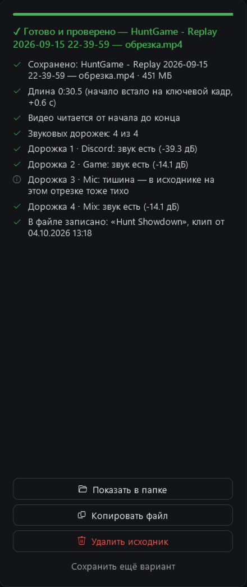</p>

</details>

<details>
<summary><b>⌨ Клавиши редактора</b> — как в Premiere, любую можно поменять</summary>

<p align="center">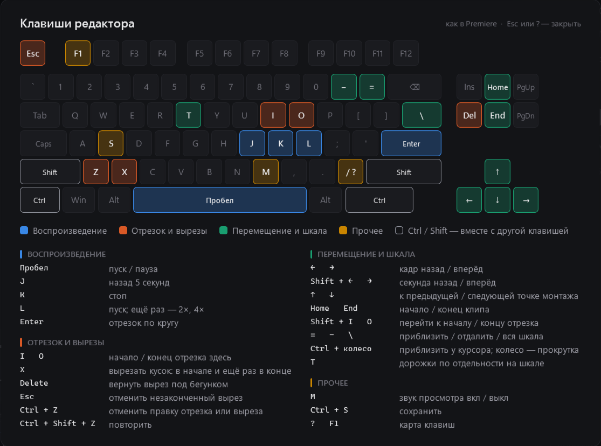</p>

| Клавиша | Действие | Клавиша | Действие |
|---|---|---|---|
| Пробел | пуск / пауза | ← / → | кадр; с Shift — секунда |
| J / K / L | назад 5 с / стоп / пуск (L ещё раз — 2×, 4×) | ↑ / ↓ | предыдущая / следующая точка монтажа |
| Enter | отрезок по кругу | Home / End | начало / конец клипа |
| I / O | начало / конец отрезка здесь | Shift + I / O | перейти к началу / концу отрезка |
| X | вырезать кусок (начало, потом конец) | `=` / `−` / `\` | приблизить / отдалить / вся шкала |
| Delete | вернуть вырез под бегунком | T | дорожки по отдельности |
| Esc | отменить незаконченный вырез | M | звук просмотра вкл / выкл |
| Ctrl + Z / Ctrl + Shift + Z | отменить / повторить | Ctrl + S | сохранить |
| ? или F1 | карта клавиш | Ctrl + колесо | приблизить у курсора |

Любую клавишу можно поменять в **«Настройки → Клавиши редактора»**: нажми на клавишу в списке, затем новую; занятая
клавиша меняется местами. Ctrl + Z / S, Ctrl + ← / → (предыдущий / следующий клип), Esc и ? не меняются. В редакторе карта открывается по `?`, F1 или значку клавиатуры.

**Горячие клавиши в игре** («Настройки → Клавиши в игре») работают, пока впереди игра: обрезать последний клип, добавить его
в избранное, скопировать для Discord, показать его карточку ещё раз. По умолчанию ни одна не назначена; в сочетании нужен
Ctrl, Alt, Shift или Win, а занятое другой программой не отнимается — об этом будет написано.

</details>

<details>
<summary><b>📈 Статистика</b> — что становится с клипами</summary>

- **Итоги месяца** сверху: клипы и часы, игра месяца с обложкой, лучший день, сколько обрезано, разница с прошлым
  месяцем. ‹ › листают месяцы; **«Копировать картинку»** (потом Ctrl+V в Discord) или **«Сохранить PNG»**.
- Плитки: сколько клипов записано (часы, ГБ), сколько обрезано, сколько лежит без обрезки (и сколько места занимает),
  сколько удалено.
- Графики: **«Клипы по месяцам»**, **«По играм»** (обрезан / лежит / удалён) и **«Готовые клипы по месяцам»**;
  при наведении — точные цифры.
- *Обрезан* — из клипа сделана обрезка в ClipKeeper (обрезки из Premiere не помнят свой исходник).
- *Удалён* — клипа нет ни в исходниках, ни в готовых. Считается с того дня, как ClipKeeper начал записывать каждый
  сохранённый клип в журнал; история копится в `clipstats.json`.
- Пока OBS не подключён и папка исходников неизвестна, ничего не считается — чтобы ничего не принять за удалённое.

</details>

<details>
<summary><b>🪟 Окно, трей и настройки</b></summary>

**Значок в трее:** 🟢 всё в порядке · 🟡 сбой, жду восстановления / буфер выключен вручную · 🔴 тревога · ⚪ OBS не запущен
(или наблюдение выключено). Клик — открыть окно; правый клик — меню с состоянием, переходами и быстрыми действиями
(«Перезапустить OBS» срабатывает со второго нажатия). Повторный запуск `ClipKeeper.exe` открывает окно уже работающей копии.

**Окно:** Библиотека, Статистика, Запись, Настройки. Открывается на библиотеке, а если с записью проблема — сразу на
«Записи»; о проблеме говорит точка у «Записи» (красная — проблема, жёлтая — внимание).

**Страница «Запись»:** общее состояние и плитки (OBS — fps и потерянные кадры, буфер, звук, экран, диск, последний клип);
ниже источники (эталон устройств) — пока всё в порядке, свёрнуты в одну строку, при проблеме раскрываются сами: **«Изменить»** меняет устройство, дорожки, громкость и «выкл. звук» прямо в OBS и
сразу запоминает, так что ClipKeeper не будет их откатывать; внизу — журнал и действия. У проблемы есть ссылка на то, что
её чинит (карточку источника или настройку), а плитки OBS, буфера и диска открывают свои настройки.

**Настройки:** на странице настроек боковая панель превращается в список её разделов в шести группах, сверху — поиск
по всем настройкам (Ctrl+F); стрелка наверху или Esc возвращает на страницу, с которой пришёл. Каждый раздел начинается
с баннера — для чего он. Изменения применяются сразу («Сохранить» нужна только для подключения). Разделы выключенной
возможности пропадают:

| Группа | Раздел | Что там |
|---|---|---|
| Основное | Общие | Language · Язык, скрытие окон от захвата, запуск вместе с Windows; возможности (наблюдение за записью, библиотека и редактор), пройти настройку заново |
| | О программе | Версия и обновления, журнал, сообщить о проблеме, проверять обновления |
| OBS | Подключение | Состояние связи; адрес, порт и пароль WebSocket |
| | Программа OBS | Где установлен OBS, запуск ClipKeeper вместе с OBS, перезапуск после падения, ежедневная копия настроек OBS |
| | Буфер повтора | Буфер повтора или обычная запись; буфер должен работать всегда, перезапуск после ошибки |
| Наблюдение | Проверки | Звук, картинка, мониторы, микшер, потерянные кадры, сбои драйвера; проверка клипов, место на диске |
| | Тревога | Ожидание перед тревогой, «сообщать, когда починилось»; окно, звук (встроенный или свой), громкость, повтор; тест тревоги |
| Клипы | Клип сохранён | Карточка, её звук (встроенный или свой) и громкость, подтверждение нажатия сразу |
| | Клавиши в игре | Обрезать, добавить в избранное, скопировать последний клип; показать его карточку ещё раз |
| | Раскладка по играм | Раскладывать клипы по играм; предупреждение о другом скрипте раскладки; шаблон папок, игра в имени файла, папка без игры; повторы, записи, скриншоты; свои названия игр, «какая игра сейчас» |
| Библиотека | Папки | Исходники, Готовые, Коллекция |
| | Игры и обложки | «Подпапки — это игры», обложки из интернета |
| | Уборка | Уборка старых клипов: сколько хранить, проверка, в корзину, раз в день |
| Редактор | Кодировщик | NVENC / AMF / Quick Sync или процессор |
| | Клавиши редактора | Карта клавиш, любую можно поменять |

</details>

## Приватность

У ClipKeeper нет аккаунтов, телеметрии и рекламы. Всё, что он узнаёт, остаётся на твоём компьютере: настройки, эталон
устройств, кэш клипов, избранное, статистика и журнал лежат рядом с `ClipKeeper.exe` (или в `%LOCALAPPDATA%\ClipKeeper`,
если в ту папку нельзя писать). Пароль WebSocket OBS хранится зашифрованным средствами Windows (DPAPI) — прочитать его
может только твоя учётная запись Windows.

Куда он обращается:

| Куда | Зачем | Как выключить |
|---|---|---|
| WebSocket OBS (по умолчанию — твой же компьютер) | Всё, что связано с записью | — |
| Steam, Википедия | Обложки и баннеры игр: ищется название игры | «Настройки → Игры и обложки → Обложки из интернета» |
| GitHub | Раз в день: есть ли новая версия | «Настройки → О программе → Проверять обновления» |

**«Сообщить о проблеме»** только открывает форму GitHub в браузере — ты видишь всё до отправки. В журнале есть названия
папок, игр и устройств: просмотри его, прежде чем прикладывать.

## Лицензия

ClipKeeper бесплатный, с открытым кодом, под [лицензией MIT](LICENSE): пользуйся, меняй, распространяй — сохраняя
указание авторства. Без каких-либо гарантий.

В архиве релиза есть и **ffmpeg** — отдельная программа под GPL, которую ClipKeeper запускает для обрезки и
просмотра; её лицензия — в `ffmpeg\LICENSE.txt`, исходники — в [BtbN/FFmpeg-Builds](https://github.com/BtbN/FFmpeg-Builds)
и на [ffmpeg.org](https://ffmpeg.org).

## Сборка и выпуск

<details>
<summary>Сборка из исходников, тесты, выпуск версии</summary>

- **Сборка:** `build.cmd` — компилятор C#, который уже есть в Windows (.NET Framework 4.8), ставить ничего не нужно.
  `build.cmd ClipKeeper.test.exe` собирает под другим именем, не трогая рабочий exe.
  Локальная сборка называет себя `0.0.0-dev`; интерфейс на WPF, он тоже встроен в Windows.
- **Гифка в начале:** `showcase.cmd` собирает тестовый exe и рисует `docs/screenshots/<язык>/showcase.gif` на обоих
  языках по текущему интерфейсу (секунд 20). Показывает настоящее, как `--preview`: клипы из `D:\Sources`, обложки,
  твои настройки — поэтому запускается локально, а не в Actions. Слайды остаются в `preview\showcase-<язык>\`;
  экраны и подписи — в `src/PreviewShowcase.cs`.
- **ffmpeg** для локального запуска: `ffmpeg.exe` и `ffprobe.exe` из [сборки BtbN](https://github.com/BtbN/FFmpeg-Builds/releases)
  (`ffmpeg-master-latest-win64-gpl.zip`, папка `bin`) положить в `ffmpeg\` рядом с exe. В git их нет.
- **GitHub Actions** (`.github/workflows/`):
  - `build.yml` — на каждый пуш в `main` и pull request: сборка и `--selftest`, exe лежит в артефактах запуска;
  - `release.yml` — на тег `v*`: сборка с версией из тега, самопроверка, архив с ffmpeg, `ClipKeeper.exe` для обновления,
    `SHA256SUMS.txt` и релиз со списком изменений. Тег с дефисом (`v1.1.0-beta.1`) — пре-релиз.
    **Подпись кода** — через [SignPath](https://signpath.org/), по желанию: с переменной репозитория
    `SIGNPATH_ORGANIZATION_ID` и секретом `SIGNPATH_API_TOKEN` собранный exe уходит в SignPath, ждёт там ручного одобрения
    (до часа) и возвращается подписанным до самопроверки и контрольных сумм. Проект в SignPath использует
    [`.signpath/artifact-configuration.xml`](.signpath/artifact-configuration.xml). Без них exe остаётся неподписанным,
    и SmartScreen предупреждает при первом запуске.
- **Ветки** по git flow: в `main` только выпущенные версии, в `develop` — следующая; работа идёт в ветках
  `feature/…` и `fix/…` от `develop` и возвращается в неё, срочные исправления — в `hotfix/…` от `main`
  (подробно в [`CLAUDE.md`](CLAUDE.md)).
- **Выпустить версию:** сделай `release/1.1.0` от `develop`; в [`CHANGELOG.md`](CHANGELOG.md) переименуй
  `## [Unreleased]` в `## [1.1.0] - <дата>`, добавь над ним новый пустой `## [Unreleased]`, поправь ссылки внизу и
  закоммить — описание релиза берётся из этого раздела, а тег без него не выпускается. Влей ветку в `main` и `develop`
  (`--no-ff`), поставь тег на `main` и отправь:

  ```bash
  git tag v1.1.0
  ```

  ```bash
  git push origin main develop v1.1.0
  ```

**Командная строка**

| Команда | Что делает |
|---|---|
| `ClipKeeper.exe --tray` | запуск свёрнутым в трей (так стартует автозапуск) |
| `--selftest [файл]` | самопроверка без OBS: логика и все окна, собранные за экраном с настройками по умолчанию |
| `--preview <папка> [--lang en\|ru]` | отрисовать все экраны в PNG (проверка дизайна, эти скриншоты) |
| `--showcase <папка> [--lang en\|ru]` | гифка для README: слайды с подписями и `showcase.gif` (`showcase.cmd` запускает её для обоих языков) |
| `--preview-settings <папка> [--lang en\|ru]` | вкладки настроек и страница «Запись» с настройками по умолчанию, папки не нужны. Workflow Build, запущенный вручную с **screenshots**, коммитит `docs/screenshots/<язык>/settings.png` |
| `--playtest <клип> <отчёт>` | прогон плеера редактора без звука и за экраном: перемотки, смена дорожки, закрытие |
| `--keytest <клип> <отчёт>` | нажать все клавиши редактора за экраном и проверить результат |
| `--trimtest <клип> <папка> <отчёт>` | сохранить во всех режимах (и с ровной громкостью, и GIF с WebP), с вырезами и пересборкой микса, и проверить файлы |
| `--mergetest <клип> <клип> <папка> <отчёт>` | склеить два клипа с затуханием и под Discord и проверить файлы |
| `--probe [файл]` | проверить, что WebSocket OBS отвечает (пароль не передаётся) |

**Файлы**

| Путь | Что это |
|---|---|
| `src/*.cs`, `ui/*.xaml`, `src/app.ico` | исходники, разметка окон, иконка |
| `src/Lang.cs` | язык интерфейса: `L.T("English", "Русский")` в коде, `"English¦Русский"` в XAML |
| `src/AssemblyInfo.cs` | версия (её подставляет релиз из тега) |
| `settings.json`, `devices.json` | настройки (пароль зашифрован) и эталон устройств — рядом с exe, не в git |
| `ClipKeeper.log` | журнал |
| `covers\`, `favorites.json`, `reviewed.json`, `clipcache.json`, `clipstats.json` | обложки и баннеры (`custom\` — свои), избранное, уже разобранные клипы, кэш клипов, история статистики |

</details>
